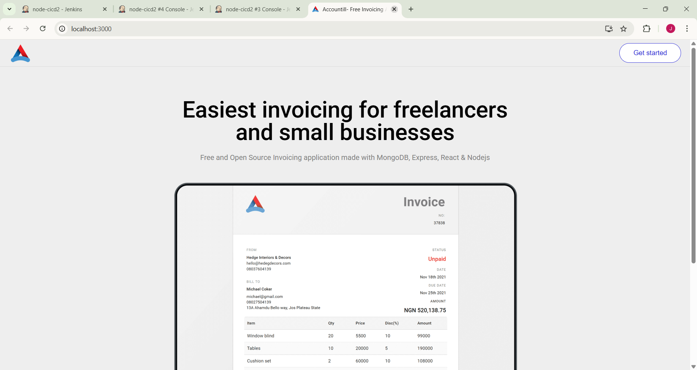
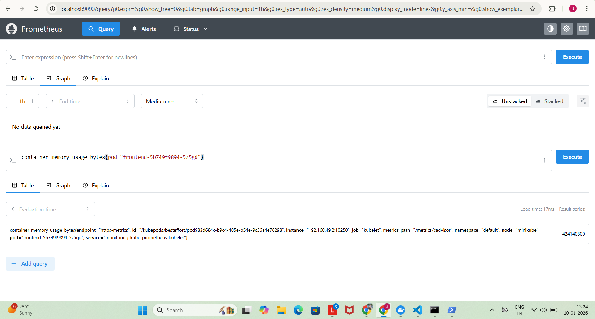
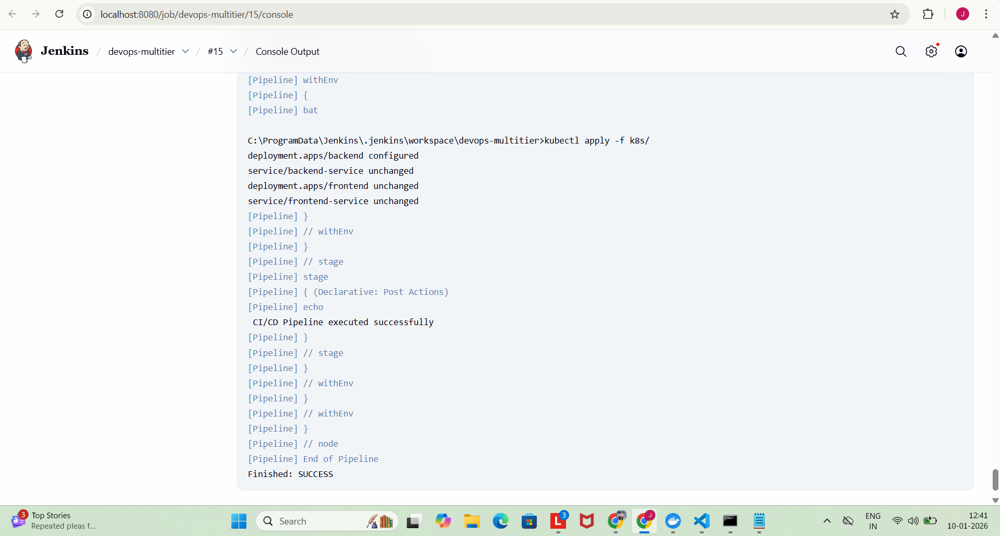

# DevOps Multi-Tier Application – Phase 1
# Project Overview

This project is a multi-tier web application built using React (Frontend), Node.js/Express (Backend), and MongoDB Atlas. It demonstrates a CI/CD pipeline with Jenkins, containerization using Docker, orchestration with Kubernetes (Minikube), and monitoring via Prometheus & Grafana.

**Frontend App**  

**Prometheus Metrics**  

**Jenkins Pipeline**  

**Grafana Dashboard**  

# Features

Full CI/CD Pipeline with Jenkins

Dockerized frontend and backend applications

Deployment to Minikube Kubernetes cluster

Backend API integration with MongoDB Atlas

Monitoring using Prometheus and Grafana

PDF generation and email sending via NodeMailer & html-pdf

Health checks for backend services

Logs & metrics visualization in Grafana

# Architecture Flow
          ┌──────────────┐
          │  Jenkins CI/CD │
          │  Pipeline      │
          └───────┬───────┘
                  │
                  ▼
        ┌─────────────────┐
        │ Docker Build &  │
        │ Push to Docker  │
        │ Hub (Images)    │
        └────────┬────────┘
                 │
                 ▼
        ┌─────────────────┐
        │  Kubernetes     │
        │ (Minikube)      │
        │ ┌─────────────┐ │
        │ │ Frontend Pod │ │
        │ │ React App    │ │
        │ └─────────────┘ │
        │ ┌─────────────┐ │
        │ │ Backend Pod  │ │
        │ │ Node.js API │ │
        │ │ MongoDB Atlas│ │
        │ └─────────────┘ │
        └────────┬────────┘
                 │
      ┌──────────┴───────────┐
      │ Prometheus + Grafana  │
      │ Monitoring Stack      │
      │ - Pod & Node Metrics  │
      │ - Visual Dashboards   │
      └──────────────────────┘

# Technologies Used

Frontend: React, React-ApexCharts, HTML/CSS

Backend: Node.js, Express.js, MongoDB Atlas

Containerization: Docker, Docker Compose

Orchestration: Kubernetes (Minikube)

CI/CD: Jenkins Pipeline

Monitoring: Prometheus, Grafana

Utilities: NodeMailer, html-pdf

# Setup & Installation
1. Clone the repository
git clone https://github.com/Jaaayyyy/devops-mutitier-project.git
cd devops-mutitier-project

# Environment Variables

Create a .env file in server/:

PORT=5000
DB_URL=<Your MongoDB Atlas Connection URL>
SMTP_HOST=<Your SMTP Host>
SMTP_PORT=<Your SMTP Port>
SMTP_USER=<Your Email>
SMTP_PASS=<Your Password>

# Build & Run Locally (Optional)
cd frontend
npm install --legacy-peer-deps
npm start

cd ../server
npm install
npm run dev

# Docker & Jenkins CI/CD

Docker images are built and pushed to Docker Hub via Jenkins pipeline.

Kubernetes manifests (k8s/) deploy frontend and backend pods to Minikube.

Minikube commands:

minikube start
kubectl apply -f k8s/
minikube service frontend
minikube service backend
# Monitoring

Prometheus collects metrics from pods and nodes.

Grafana visualizes metrics in dashboards.

Access Grafana
kubectl port-forward svc/monitoring-grafana 3000:3000

Open http://localhost:3000

Default credentials (from Kubernetes secret):

kubectl get secret monitoring-grafana -o jsonpath="{.data.admin-user}" | base64 --decode
kubectl get secret monitoring-grafana -o jsonpath="{.data.admin-password}" | base64 --decode

Explore CPU, memory, pod status, and frontend/backend metrics.

# CI/CD Pipeline Stages

Checkout Code – Fetch code from GitHub.

Login to Docker Hub – Authenticate Jenkins to push images.

Build Docker Images – Build frontend and backend images.

Tag Docker Images – Tag images for Docker Hub.

Push Docker Images – Push images to Docker Hub repository.

Deploy to Kubernetes – Apply Kubernetes manifests to Minikube.

Monitoring – Prometheus & Grafana dashboards monitor cluster & pods.

# Additional Features

PDF invoices generation and email delivery.

React charts for frontend dashboard.

Health check endpoint (GET /) to confirm server status.

Environment variable configuration for database and email services.

# Notes

Phase 1 is limited to frontend, backend, and monitoring.

Phase 2 can include AWS EKS deployment, alerts, logging stack (ELK/EFK), and advanced CI/CD.

Jenkins must have access to Docker and Kubernetes CLI (kubectl) on the server node.

# Authors

Jayesh Malshikare –  DevOps engineer

GitHub: https://github.com/Jaaayyyy